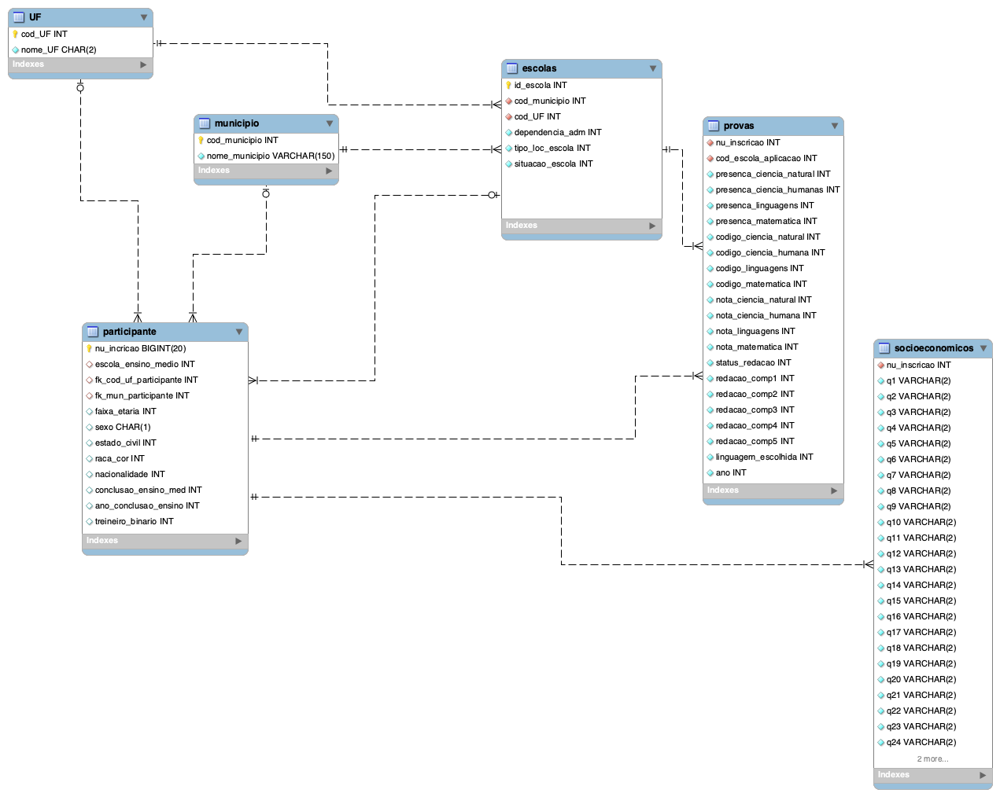

# Introdução

Esse projeto tem o objetivo de estruturar dados do enem em bancos de dados e analisar os dados utilizando métodos estatísticos. 

Conhecimentos adquiridos/aprimorados durante o projeto:

* Spark
* SQL
* Python
* Bash/Linux/Unix
* Modelagem de dados

# Modelagem de dados

A modelagem de dados será normalizada de acordo com as três formas normais de Boyce-Codd. A normalização é o processo de análise que visa assegurar qie i,a relação está bem estruturada. A adesão das formas normais visa eliminar/mitigar as anomalias de inserção, remoção e atuailização das tabelas e/ou banco de dados.

## 1FN

## 2FN

## 3FN

